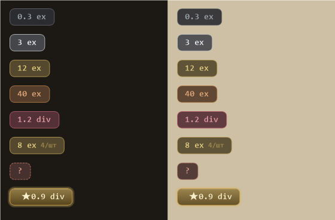

<div align="center">


# PriceCheck — Path of Exile 2

**Оверлей, который мгновенно оценивает награды пилонов прямо в игре.**
Открыл пилон → увидел цену каждой награды и лучший выбор. Без alt-tab, без копипасты.

[](https://github.com/5HeadExile/PriceCheck-Path-Of-Exile-2/releases/latest)
[](https://github.com/5HeadExile/PriceCheck-Path-Of-Exile-2/releases)
[](#-установка)
[](#)
[](LICENSE)

### [⬇️ Скачать последнюю версию](https://github.com/5HeadExile/PriceCheck-Path-Of-Exile-2/releases/latest)

</div>

---

## 💡 Зачем это

Пилоны (лиг-механика **«Runes of Aldur»**) дают на выбор несколько наград — и
далеко не всегда очевидно, какая из них дороже. PriceCheck читает панель пилона
через **OCR**, тянет актуальные цены с **poe.ninja** и рисует ценник напротив
каждой награды поверх игры, подсвечивая **самую выгодную** ★. Решение — за секунду.

<div align="center">

<br/>
<sub>Ценники-плашки: градация по стоимости, цена за штуку для стака, ★ — лучшая награда. Слева — на тёмном фоне, справа — на пергаменте панели.</sub>
</div>

## ✨ Возможности

| | |
|---|---|
| 🎯 **Авто-режим** | Открыл пилон — цены появились сами; закрыл — скрылись. Никаких кнопок. |
| 🏆 **Лучший выбор** | Самая ценная награда подсвечивается золотом и ★. |
| 🔎 **Надёжный OCR** | Много-проходное распознавание под панели любой яркости. |
| 📐 **Авто-масштаб** | Ценники сами подгоняются под разрешение монитора. |
| 💰 **Живые цены** | poe.ninja (раздел PoE2), кэш с обновлением и самовосстановлением. |
| 🧩 **Несколько пилонов** | Калибруешь каждый — оценивает все, лучший помечает ★. |
| 📸 **Режим скриншота** | `F6` — показать ценники в захвате экрана для скриншота. |
| 🪶 **Лёгкий** | Сидит в трее, не лезет в процесс игры, click-through оверлей. |

> ⚠️ Игра должна работать в режиме **windowed-fullscreen** — иначе оверлей и
> хоткеи не видны поверх неё.

## 🚀 Установка

1. **Скачай** [`PriceCheckPoe2.exe`](https://github.com/5HeadExile/PriceCheck-Path-Of-Exile-2/releases/latest) и запусти — приложение свернётся в трей.
   _Self-contained: .NET ставить не нужно._
2. В игре нажми **`F2`** → «Выделить область» → **обведи панель пилона**.
3. **Открой пилон** — цены появятся сами. Лучшая награда помечена ★.

Готово. Калибровка запоминается; для разных пилонов добавь несколько областей.

## ⌨️ Хоткеи

| Клавиша | Действие |
|:---:|---|
| `F2` | Игровое меню (настройки, калибровка, пауза) |
| `F4` | Выделить область пилона (калибровка) |
| `F6` | Режим скриншота — показать ценники в захвате |
| `F3` | Debug-рамки откалиброванных областей |

_Все хоткеи настраиваются в `config.json`._

## ⚙️ Как это работает

```
Панель пилона  →  Захват области  →  OCR (Tesseract)  →  Разбор «Nx Имя»
                                                              ↓
   Оверлей с ценами  ←  Лучший = max(EV)  ←  Цена × стак  ←  poe.ninja
```

Фоновый монитор по яркости области определяет, открыт ли пилон, и запускает
распознавание только при открытии/смене содержимого — поэтому нагрузки почти нет.

## 🛠️ Сборка из исходников

```powershell
cd src
dotnet build -c Release
dotnet test
```

Релизный single-file exe:

```powershell
dotnet publish src/PriceCheckPoe2/PriceCheckPoe2.csproj -c Release -r win-x64 `
  --self-contained -p:PublishSingleFile=true -p:IncludeAllContentForSelfExtract=true `
  -p:EnableCompressionInSingleFile=true -p:DebugType=none -o release
```

## 🧩 Стек


`net8.0-windows` · WinForms + WPF · Tesseract OCR · SharpHook (глобальные хоткеи)
· Newtonsoft.Json. Цены — poe.ninja (раздел PoE2).

## 📄 Лицензия

[MIT](LICENSE). За основу взят открытый проект
[PoeAncientsPriceHelper](https://github.com/pedro-quiterio/PoeAncientsPriceHelper) —
атрибуцию сохраняем.

<div align="center"><sub>Сделано для PoE2 · не аффилировано с Grinding Gear Games</sub></div>
